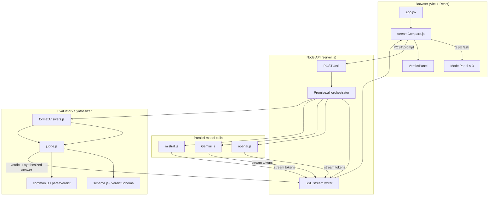

# SelfAssistant

A GenAI self-consistency app that sends one user prompt to multiple LLMs, compares their answers, and produces a **synthesized final response** — not a copy of any single model.

## Type

**UI-based web app** (Vite + React frontend, Node HTTP API backend).

A CLI entry point exists at `index.js` (`npm run cli`) but is currently commented out. The primary experience is the web UI.

## Models & providers

| Role | Provider | Model |
|------|----------|-------|
| Generator | OpenAI | `gpt-5.6` |
| Generator | Google Gemini | `gemini-3.1-flash-lite` |
| Generator | Mistral | `mistral-large-latest` |
| Evaluator / Synthesizer | OpenAI | `gpt-5.6-terra` |

All three generators receive the **same prompt in parallel**. The evaluator reads every response, scores each model's contribution, and writes a **new synthesized answer** that combines the strongest accurate points.

## How it works

1. **User enters a prompt** in the React UI.
2. **Orchestrator** (`server.js`) sends the prompt to OpenAI, Gemini, and Mistral simultaneously via `Promise.all`.
3. **Streaming** — each model's tokens are pushed to the browser over Server-Sent Events (SSE) so the user sees answers appear live.
4. **Collection** — once all streams finish, answers are normalized (`formatAnswers.js`).
5. **Evaluation & synthesis** — the evaluator model (`judge.js`) receives all answers (in randomized order to reduce position bias), compares them, and returns:
   - `winner` — which model contributed the most useful material
   - `reasons` — per-model evaluation notes
   - `bestAnswer` — a **new synthesized answer** written by the evaluator (not copied from any one model)
6. **Display** — the UI shows three model panels plus a "Synthesized answer" verdict panel.

## Self-consistency flow

Traditional self-consistency samples multiple outputs from one model and aggregates them. This project applies the same **idea across multiple providers**:

```
Same prompt → Multiple independent answers → Evaluator compares & synthesizes → One refined final answer
```

The evaluator is instructed to:
- Pull the strongest accurate facts from each model
- Drop filler, repetition, and contradictions
- Write a standalone answer in its own words
- Never copy a single model verbatim

If synthesis fails, the system falls back to the winning model's answer as a last resort.

## Architecture



### Key files

| File | Responsibility |
|------|----------------|
| `src/App.jsx` | User input, loading state, panel layout |
| `src/lib/streamCompare.js` | SSE client, parses stream events into UI state |
| `server.js` | HTTP API, parallel orchestration, SSE responses |
| `src/utils/openai.js` | OpenAI streaming + structured parse calls |
| `src/utils/Gemini.js` | Gemini streaming |
| `src/utils/mistral.js` | Mistral streaming |
| `src/utils/judge.js` | Evaluator prompt, synthesis instructions |
| `src/utils/common.js` | Verdict parsing; prefers synthesized `bestAnswer` |
| `src/utils/formatAnswers.js` | Answer normalization for judge input |
| `src/components/VerdictPanel.jsx` | Synthesized answer display |

## Stack

- **Frontend:** Vite + React (JavaScript), `react-markdown`
- **Backend:** Node HTTP API (`server.js`)
- **Validation:** Zod structured output for judge responses

## Setup

```bash
cd SelfAssistant
npm install
```

API keys in `SelfAssistant/.env`:

```
OPENAI_API_KEY=...
GEMINI_API_KEY=...
MISTRAL_API_KEY=...

# Optional
MODEL_TEMPERATURE=0.7
PORT=3001
```

## Run

```bash
npm run dev
```

- UI: http://localhost:5173
- API: http://localhost:3001 (`/ask` proxied by Vite in dev)

Or from the repo root:

```bash
npm run selfassistant
```

## Scripts

| Script | What it does |
|--------|----------------|
| `npm run dev` | API + Vite UI together |
| `npm run dev:api` | API only (port 3001) |
| `npm run dev:ui` | Vite only (port 5173) |
| `npm run cli` | Terminal compare (`index.js`, currently commented out) |
| `npm run build` | Production React build |

## Error handling

- Invalid or empty prompts return HTTP 400
- Each model reports its own error if it returns no text (API key, network, etc.)
- Judge errors are surfaced in the verdict panel
- If at least one model responds, synthesis still runs on available answers
- Global request failures are caught in both server and client
